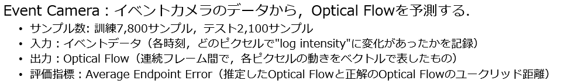

# hydraの使い方

https://zenn.dev/gesonanko/articles/417d43669cf2af

### gettingstarted

https://hydra.cc/docs/intro/

#### 2024年6月25日12:19

lossが増えている→過学習？

dropoutを実装する→lossが増加する

#### 2024年6月25日13:28

trainデータの中身を確認する

#### 2024年6月27日

バッチの擬似的拡張
https://kozodoi.me/blog/20210219/gradient-accumulation
    for x, _ in train_dl:
        step_count += 1
        model.train()
        x = x.to(device)

    rec_img, mask = model(x)
        train_loss = torch.mean((rec_img - x) ** 2 * mask) / config["mask_ratio"]
        train_loss.backward()

    if step_count % 8 == 0:  # 8イテレーションごとに更新することで，擬似的にバッチサイズを大きくしている
            optimizer.step()
            optimizer.zero_grad()

    total_train_loss += train_loss.item()

多分勾配消失を起こしているので修正する。

- 異なるスケールでのロスを足し合わせる．
  - ベースラインモデルはUNet構造なので，デコーダーの中間層の出力は最終的な出力サイズの0.5,0.25,...倍になっています．各中間層の出力を用いてロスを計算することで，勾配消失を防ぎ，性能向上が見込めます．

dataのpickle化によるロード短縮化
https://hyper-pigeon.hatenablog.com/entry/2021/08/04/225814

#### 2024/06/29

勾配クリッピングは活用できる？DL第六回

softmaxの勾配が小さくなるのを防ぐためで,Scaled Dot-Product
Attentionと呼ばれる.

GANによる画像生成　第10回

画像の前処理．- 画像の前処理には形状を同じにするためのResizeのみを利用しています．第5回の演習で紹介したようなデータ拡張を追加することで，疑似的にデータを増やし汎化性能の向上が見込めます．ただし，イベントデータは非常に疎なデータなので少し工夫が必要かもしれません．

https://pystyle.info/pytorch-list-of-transforms/

random_cropが使える？

#### 2024/07/10

num_bins16,batch_extend=16をためす

num_bins16にするとエラーが出る
RuntimeError: Error(s) in loading state_dict for EVFlowNet:
	size mismatch for encoder1.0.weight: copying a param with shape torch.Size([64, 4, 3, 3]) from checkpoint, the shape in current model is torch.Size([64, 16, 3, 3]).

model.load_state_dict(torch.load(model_load, map_location=device))

#### 2024/07/11

画像の前処理

validの実装
